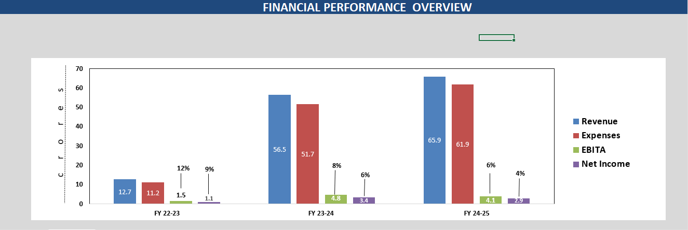
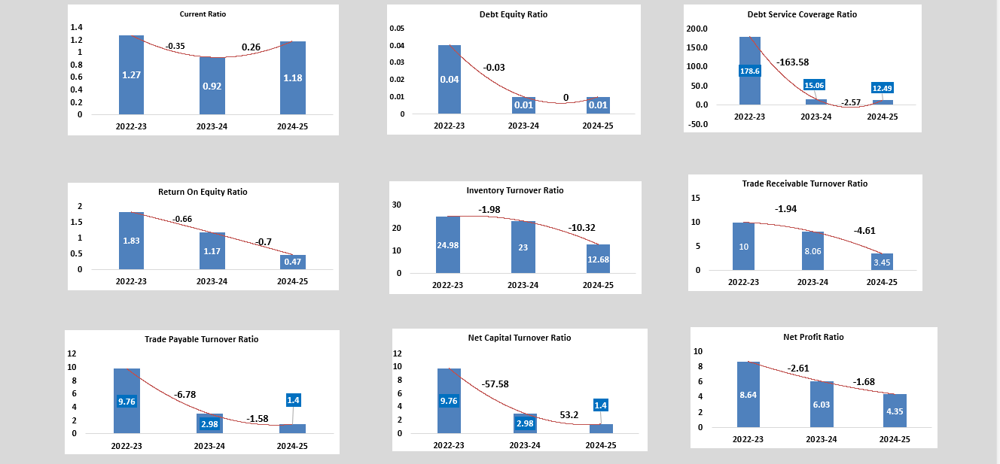
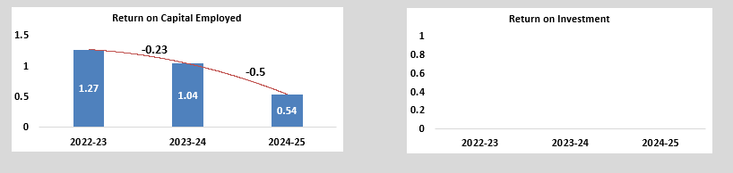

# Financial Data Dashboard – Winfra Buildtech Private Limited 

This project is an interactive Financial Dashboard created in Microsoft Excel using 3 years of financial data of Winfra Company.

## Project Overview

The dashboard helps analyze the company’s financial performance over the last 3 years through charts, KPIs, ratio analysis, and trend visualization.

## Key Features

- 3 Years Financial Data Analysis
- Revenue, Expense & Profit Summary
- Year-wise Comparison
- Financial Ratio Analysis
- Trend Graphs & Performance Charts
- KPI Cards for Quick Insights
- Dynamic Filters / Slicers
- Pivot Table Based Reporting

## Ratios Covered

- Profit Margin Ratio
- Current Ratio
- Debt to Equity Ratio
- Return on Investment (ROI)
- Growth Ratio
- Expense Ratio

## Tools Used

- Microsoft Excel
- Pivot Tables
- Pivot Charts
- Lookup Functions
- Conditional Formatting
- Data Cleaning
- Dashboard Design

## Business Insights

- Identified yearly growth trends
- Compared profit margins across years
- Monitored expense increase/decrease
- Evaluated financial health through ratios
- Supported decision making with visuals

## File Included

- Financial_Data_Dashboard.xlsx

## Dashboard Preview

## Author
Vandana Singh Yadav
Aspiring Data Analyst
